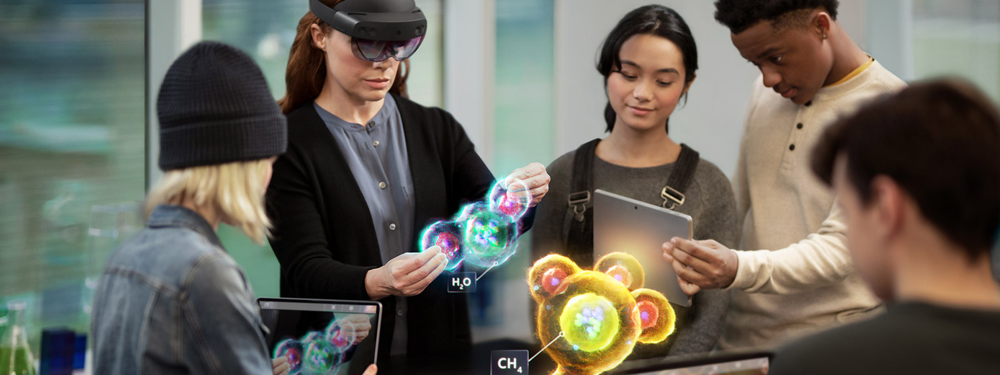

# Education On ENVerse

<figure><figcaption>
Microsoft MR Classroom
</figcaption></figure>

Technology is constantly playing a role in improving education delivery in Africa. The quality of education and quantity of well equipped schools and teachers has steadily increased. But the pandemic has since changed the education landscape. We've seen how digital innovation and Technology has helped the education community overcome unforeseen challenges through the use of Web 2.0 products e.g. Google Classroom, Zoom etc.

In line with the United Nations Sustainable Development Goal 4  _"Ensure inclusive and equitable education and promote life-long learning opportunities for all"_  ENVerse through it's education cluster will be creating an immersive virtual learning environment designed to give easy onboarding to Web 2.0/Web 3.0 Ed-Tech projects and stakeholders in education across the African continent and beyond.

Web 2.0/ Web 3.0 projects within the ecosystem are able to provide learners and stakeholders a more immersive breath-taking, exciting and out-of-classroom experiences with the seamless onboarding strategy education brands will purchase land plots (varied sizes) within the education cluster and setup their brands either by employing our drag and drop tools or by creating custom experiences.\
\
ENVerse will also be assisting Schools, Universities and Teachers to set up their own learning spaces within the Metaverse giving students access to use Augmented reality to learn more about subjects, topics and objects within and outside their curriculum with better interaction.
