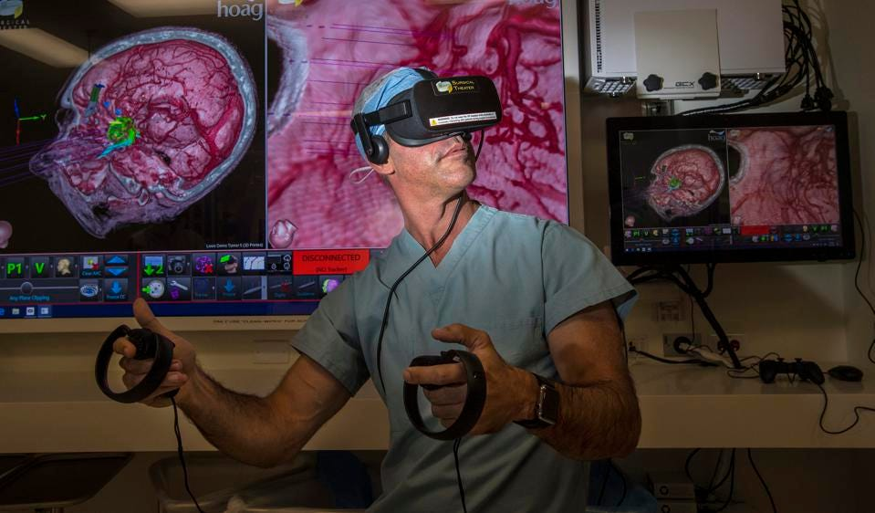

# Healthcare On ENVerse

<figure><figcaption>
Africa Health ExCon -Egypt
</figcaption></figure>

It is clear that technology is significantly advancing healthcare in the areas of prevention, diagnosis and patient treatment, with the Covid-19 turn of events Tele-health is becoming integrated into the African healthcare system and with the advent of Tele-medicine, Tele-physiotherapy and the metaverse, people now have the possibility to explore a complete healthcare world in 3D to take advantage of services such as therapies, consultations, social interactions and health education.

<figure><figcaption>
Healthcare in Metaverse, AR, VR --Forbes
</figcaption></figure>

ENVerse healthcare cluster will be providing easy onboarding for new and existing Web 2.0/ Web 3.0 E-health projects across the African continent while promoting the United Nations Sustainable Development Goal 3 _"Ensure healthy lives and promote wellbeing for all at all ages"_

\
ENVerse healthcare cluster offers an immersive 3D experience for patients, families, students, nurses, doctors, physiotherapist, occupational therapists and all key stakeholders in healthcare.
