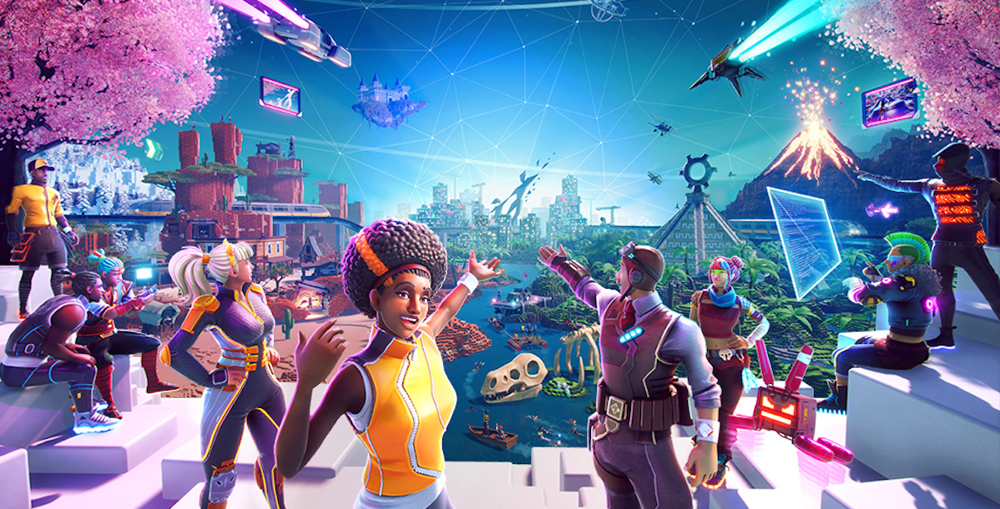
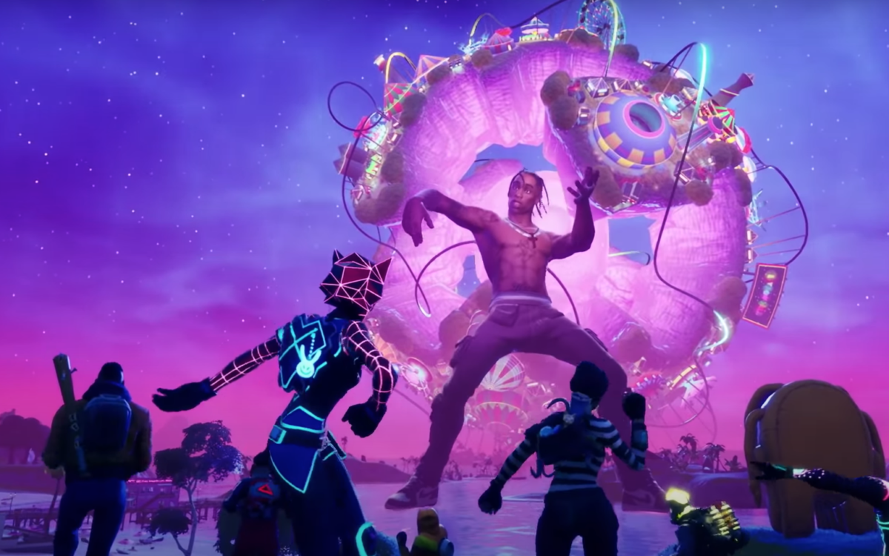

# Africa In Context

<figure><figcaption>
Image: Coinculture
</figcaption></figure>

### Africa in context: A focus on Entertainment(Movies, Music, Games and Art), FinTech, Education and Healthcare.

Africa's Film and Music industry has seen a remarkable transformation and growth with it's adoption of latest technological trends. Stories on the continent are abundant and over the years perceptions of the African creative industry has changed, there is now an even hungrier market for films made in Africa and about the continent. Driven by a youthful demographic, expanded internet connectivity and a growing array of connected devices. African Music and Films industry is flourishing with respect to it's dividends being distributed to video and Music streaming services, scriptwriters, showrunners, record labels, studios and lastly the content creators. The African film industry has a rich and diverse history, with a range of genres and styles being produced on the continent. \
In recent years the industry has experienced significant growth and development, with a number of talented filmmakers and actors gaining international recognition.\
\
In the 21st century, the African film industry has continued to grow and evolve. <mark style="color:green;">Nigeria alone produces around 2,500 films a year</mark>, which contributes about 5 Billion Dollars to the continent's GDP. Africa's potential as a film power house remains largely untapped despite a significant growth in production across the continent and ENVERSE through its virtual streaming marketplace and virtual movies theatres aimsto create seamless and more rewarding streaming experiences for both local and globalconsumers of African movies and music, as well as reduce the issues surroundingcontent distribution across the continent.\

<figure><figcaption>
Will Africa embrace the Metaverse? Image: ANA
</figcaption></figure>

\
The rhythm of Africa has been making a massive impact globally with it's Afro-Pop, Amapiano style and massive hits like Unforgettable by Moroccan-American artist French Montana ft Swae Lee, Master KG's Jerusalema, Love Nwantiti by Nigerian artist CKay, Tigini by Ivorian artist KikiMoteleba and Essence by Nigerian singer Wizkid. The traction of African music Genres globally has the most powerful people in entertainment trying to figure out how to discover the next big artist. Musically speaking Africa is a landscape that is so culturally rich, vibrant and dynamic. There is a great potential for African music to be exported globally or consumed locally on a scale larger than ever before by transitioning into a more robust Web 3.0 economy.

Digital health is a rapidly growing field in Africa that aims to use technology to improve the delivery and accessibility of healthcare services in the region. There are a variety of ways in which digital health is being implemented in Africa, including the use of mobile health (mHealth) platforms, electronic medical records (EMR) systems, and telemedicine services. Digital health in Africa gives an opportunity for African health systems, given the high penetration rates of mobile phones usage. E-Health (Tele-medicine, Tele-Physiotherapy and Tele-Pharmacy) solves the problems of accessibility to quality health options, improves public health awareness, enhances patient care, Increases revenue for stakeholders in the health sector and provides quality data for decision makers amongst many other benefits. \
ENVERSE metaverse through its healthcare cluster will be providing new opportunities and solving basic problems of physical accessibility in African healthcare through:&#x20;

* **Virtual consultations**: This would allow patients to access healthcare services from anywhere, regardless of their physical location.&#x20;
* **Virtual rehabilitation**: This would allow patients to participate in therapy sessions from the comfort of their own homes.&#x20;
* **Virtual training**: Healthcare providers could use the ENVERSE for virtual training and education, allowing them to learn new skills and techniques in a simulated environment.
* **Virtual patient education**: ENVERSE metaverse could be used to provide patient education, allowing patients to learn more about their health conditions and treatments in a virtual setting.

Since the event of Covid-19 there has been a major shift in the education sector in Africa and globally as most stakeholders in education now embraces digital education more, online study is slowing replacing traditional in- classrooms. ENVERSE metaverse through its education cluster can be used as a platform for online classes and meetings. In this scenario, students and teachers can meet in a virtual classroom and interact with each other and with virtual educational materials in real-time. This solves the problems of accessibility to quality education especially in situations where students are not able to physically attend classes due to geographical distance or other circumstances.
