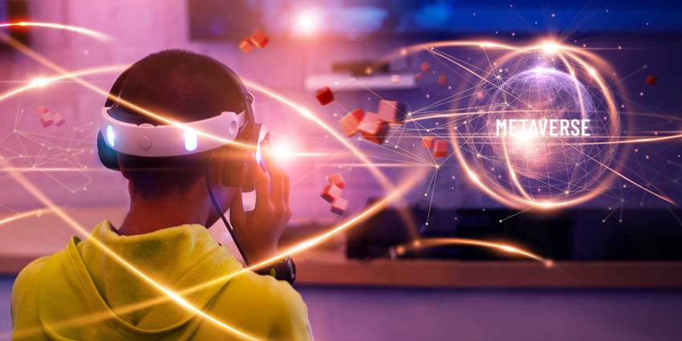

# What is the Metaverse?

The term Metaverse is used to describe a combination of the virtual realty and Mixed reality worlds accessed through a browser/headset/other devices which allows people to have real time interactions and experiences across distance. For simplicity sake, think of the Metaverse as the next iteration of the internet.\

<figure><figcaption>
Business in the Metaverse --XRToday 
</figcaption></figure>

\
The Metaverse matters because it will create meaningful human connections and unprecedented access to opportunities no matter where we are. It is about how people interact which each other and the spaces they create. It is a virtual layer that gives a sense of place and connect people across many contexts.\
\
Entertainment (Movies, Music, Games and Art), Education, Finance and Healthcare as an essential aspect of our traditional society is at the fore-front of the Metaverse adoption. ENVerse therefore aims to drive the massive adoption of the Metaverse in Africa to empower a paradigm shift that shall in turn solve the critical issues in Entertainment( Movies, Music, Games and Art industry), Education, Finance and Healthcare in Africa.\
\
Ultimately, ENVerse will change the present face of Entertainment, Education, Finance and Healthcare in Africa and create new opportunities and connections for people no matter where they are.
