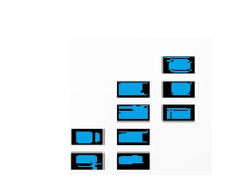

# Clusters

<figure><figcaption></figcaption></figure>

### Central Cluster

<figure><figcaption></figcaption></figure>

This is the initial landing site of all users reserved for custom made experiences within the metaverse such plethora of shops, billboard advertisements, art galleries, movie channels, free games etc. Here users have the opportunity to visit different clusters available on ENVerse through "_mapped portals_" in order to have memorable experiences, engage different contents, meet different people and engage creatives across the continent and so on.

* [x] Education Cluster
* [x] Movies and Music Arena
* [x] Health & Wellness Cluster
* [x] Private Cluster
* [x] Public Cluster
* [x] Financial Cluster

### Education Cluster

<figure><figcaption></figcaption></figure>

The Education Cluster houses ENVerse Web 3.0 University Academy through which users can choose to learn from the array of courses available this includes:

* [x] Crypto Currency
* [x] Coding Concepts
* [x] Metaverse Development and lots more.

Stakeholders such as schools, libraries, learning centres will also be onboarded on the education cluster.

### Movies, Music, Nature Parks/Safari & Games Cluster

<figure><figcaption></figcaption></figure>

* [x] ENGames collections will be based here:  Game creator will be based here to allow individuals create games, purchase pets and battle with them.
* [x] ENClips our movie streaming theater will be based here.
* [x] ENMusic our music streaming platform will be based here.
* [x] Musical Concerts will hold here.
* [x] Movie Festivals and Awards will hold here.
* [x] Safari & nature parks will be based here.

### Private Cluster

<figure><figcaption></figcaption></figure>

Users can create a fully customizable private cluster that can't be publicly accessed via the central cluster. There is a maximum number of users per time. Owners of private clusters can add features such as but not limited to these:

1. Have their own token that can be used across the private cluster.
2. Own shops within the private clusters, Here they can sell individual digital assets.
3. Add aesthetic features that can be integrated into the privates.
4. Buying the rights to allow NFT exclusive access only.
5. Have the right to only allow access via a password.
6. Have access to increase members access limit.

### P**ublic Cluster**

****

<figure><figcaption></figcaption></figure>

Users can create fully customizable public cluster that can be publicly accessed. There is no maximum number of users. Public brands that seek the metaverse presence or seek more customers will benefit from this. Owners of public clusters can add features such as but not limited to these:

1. Have their own token that can be used across the public cluster.
2. Own shops within the public clusters, Here they can sell individual digital assets.
3. Add aesthetic features that can be integrated into the public.

### Financial **Cluster**

****

<figure><figcaption></figcaption></figure>

The Financial Cluster will be hosting plethora of crypto and fiat exchanges, banks etc. This is the home of social trading within the ENVerse metaverse where users enjoy the benefits of trading within the metaverse. Users can trade assets such as:

1. NFTs
2. Tokens
3. Commodities
4. Bonds
5. Tokenized Stocks etc.
